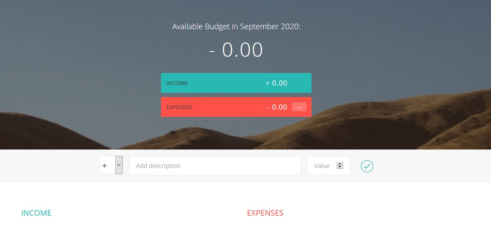
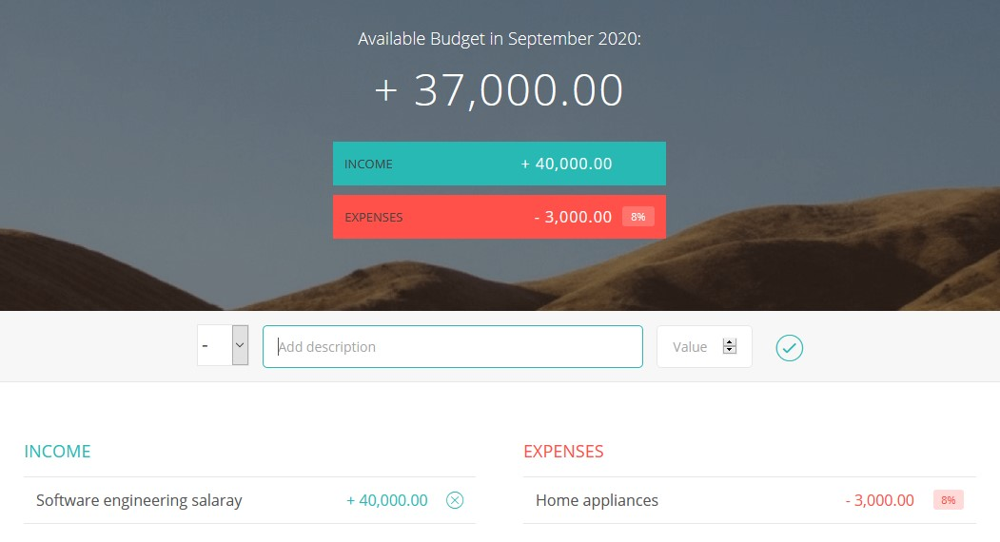

# Purpose

The purpose of this application is to provide a simple way to calculate budget.
I thought of this as a cool concept, and have thought of even considering creating
an application side of it.

# Technologies

This budget application is written in Javascript ( ES5 encompassing features ),
making use of DOM manipulation API, where the front end is written in HTML5 & CSS3

# Usage and Functionality

The application is relatively straight forward to use. The user is introduced
to an interface like this :

### Loaded Interface

### Adding Information

- User may then enter an income or expense with a drop-down menu of `+` or `-`,
- A description of the income/expense, Ex: `Home appliances`
- They then enter the value with input or with the direction keys on the right, Ex: `1200`

The given interface changes to :

### Changing information

- The user may then hover over the queries and press on the `x`, to delete the query
- They are also able to see the percentage of their income spent, Ex : `%8`
- When expenses exceed negative values are displayed
